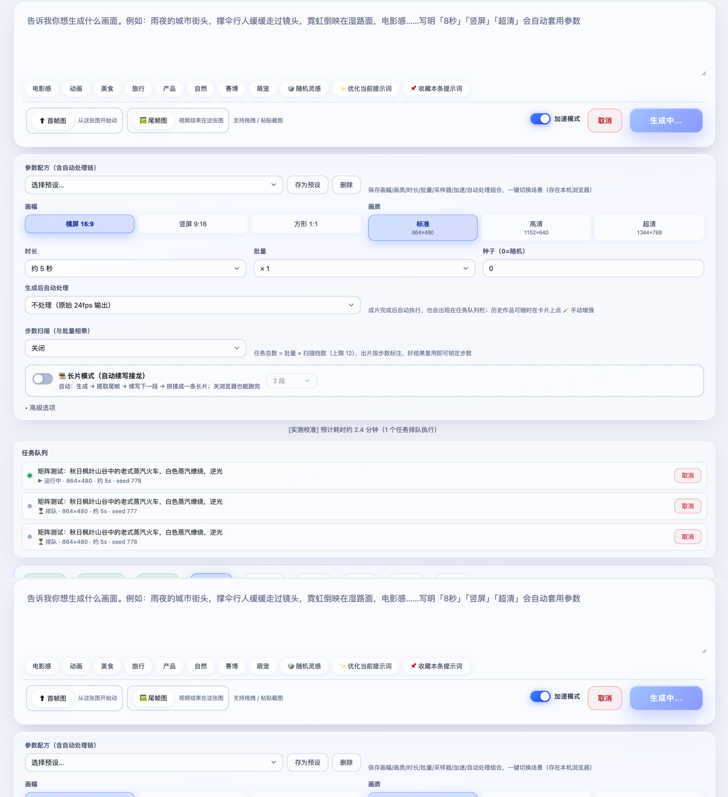
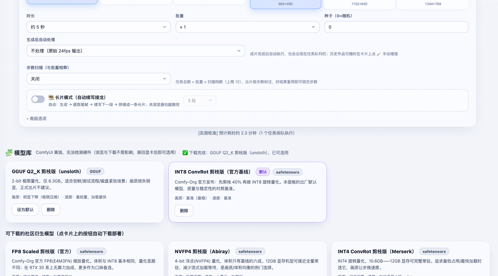

# MiniMax-H3 视频生成面板

一个为 **MiniMax-H3 视频模型 + ComfyUI** 打造的单文件 Web 面板：把节点图工作流变成「打字描述 → 点生成 → 拿成片」的傻瓜式体验，同时保留 ComfyUI 级别的过程透明度。

> 适用对象：已经在 ComfyUI 里跑通 MiniMax-H3 官方工作流的用户。面板不替代 ComfyUI，而是作为它的专职前端。

## 特性

**生成**
- 文生视频 / 图生视频 / 首尾帧定界（支持拖拽、粘贴截图）
- 长片自动接龙：生成 → 提取尾帧 → 续写 → 自动拼接，关浏览器也能跑完
- 参数矩阵：步数扫描 × 批量种子组合排队（上限 12 任务）
- 画幅 16:9 / 9:16 / 1:1 × 三档画质，写进提示词自动套用（「8秒」「竖屏」「超清」）
- Turbo LoRA 加速（v7.0）：官方蒸馏 LoRA 4/8 步出片，模型库一键下载，与加速缓存互斥自动锁步数

**角色一致性（v8.1，AI 漫剧核心）**
- 模型库下载「Ref2VA 角色一致性版」权重后，创作台出现「🧑 角色图」上传位
- 上传一张角色设定图，模型在每个采样步参考该图的身份特征，跨镜头锁定同一角色
- 通宵批量全批共用一张角色图——贴 8 行分镜 + 一张角色图，挂机出一条完整漫剧
- 参考档位：match（快）/ max（身份保真最强，约 +70% 耗时）
- LoRA 按家族配对：FL2VA 模型配 FL2VA Turbo LoRA，Ref2VA 模型配 Ref2VA Turbo LoRA

**智能长片 + 通宵批量（v6~v8）**
- 长片接龙：生成 → 提取尾帧 → 续写下一段 → 自动拼接，关浏览器也能跑完
- **智能长片**：输入框写多行提示词（或用「✂️ 拆分成多段」把一段故事自动拆开），每段用各自的场景提示词 + 尾帧连续续写，产出真正连贯的故事长片
- 通宵批量：多行提示词 × 每条 1/2/4 种子（≤240 任务）无人值守连续生成；支持首帧图批量图生视频、定时开始、跑完自动拼接合集
- 面板重启自动续跑（含在途任务收尾）；单任务失败跳过；ComfyUI 断连按分钟级重试
- 与创作台共用队列：通宵跑着也可以随时插队临时任务

**容量与作品管理（v7~v8）**
- 作品库按批次筛选（🌙 批次来源）、卡片显示模型/Turbo LoRA 徽章
- 按分类统计数量与体积；两步式清理（预览 → 确认），固定保护星标与最近 7 天
- `auto_backup_dir` 成片自动备份到指定目录

**模型库（v5.0）**
- 内置 12 款社区衍生模型目录：官方 INT8/FP8 基线、NVFP4、INT4、W4A8、混合量化、GGUF Q2_K～Q8_0、FastH3 4 步加速版，每款带画质/速度说明
- 按本机显存自动给适配推荐（可常驻显存 / 流式加载 / 不建议三档）
- 一键下载部署：实时进度/速度/剩余时间，断点续传，hf-mirror 主源 + 官方源自动回退，下载完即刻可选用
- 创作台高级选项下拉切换模型；作品复用、参数配方、长片接龙全线携带模型维度
- GGUF 量化支持（需 ComfyUI 安装 ComfyUI-GGUF，见 DEPLOY-NOTES 一节）；加速版权重自动锁定步数/互斥加速开关

**看得见的过程**
- 9 节点流水线实时可视化（模型加载 → 提示词编码 → 加速缓存 → 采样 → … → 保存入库），当前节点呼吸高亮
- 任务队列栏：运行/排队逐条展示，支持单任务取消
- 页面刷新/关闭不丢任务：服务端后台线程跟踪，完成自动入库，重启自动续接

**AI 增强（可选，需 NVIDIA GPU）**
- RIFE 插帧 ×2（24fps → 48fps，5 秒片段约 15 秒）
- Real-ESRGAN 超分 ×2（864×480 → 1728×960）
- 全链配方：插帧 → 超分一键完成，可存进参数配方作为默认处理链
- 显存保护：不足时自动让 ComfyUI 卸载闲置模型

**专业细节**
- 真实耗时统计：按「分辨率×帧数×步数×加速」分桶校准预计耗时（显示「[实测校准]」）
- OOM 历史预警：同参数组合真实失败过会提前红字警告
- 完整参数元数据：作品卡一键复用全部参数（含采样器/调度器），精确复现
- 失败一键重试、作品 2-4 个并排同步对比、星标收藏、提示词优化与收藏夹
- 访问口令（可选）：局域网/公网分享时加一道门

## 截图

| 创作台 | 生成中流水线 | 模型库 |
|---|---|---|
|  |  |  |

## 环境要求

| 依赖 | 说明 |
|---|---|
| ComfyUI | 已能跑通 MiniMax-H3 官方工作流（含 H3 全套权重与官方节点包） |
| NVIDIA GPU | 建议 ≥12GB 显存（显存预算可在配置中按需调整） |
| Python | 3.10+（若跑 AI 增强，需与 torch CUDA 环境一致） |
| ffmpeg / ffprobe | 系统命令行可用 |

## 快速开始

> 让 AI 智能体代劳？本仓库自带部署技能：把 `skills/minimax-h3-panel-deploy/` 拷入智能体的技能目录（如 `~/.agents/skills/`），之后直接说「帮我部署 H3 面板」即可——技能里包含环境体检脚本、逐步安装流程与实测排障手册。

```bash
git clone https://github.com/hongjiahao371-pixel/minimax-h3-panel.git
cd minimax-h3-panel
pip install -r requirements.txt
```

1. 复制配置模板并按你的环境修改：

```bash
cp panel/config.example.json panel/config.json
```

必改两项：`output_dir`（ComfyUI 输出目录）与 `comfy_models_dir`（ComfyUI 的 `models/diffusion_models` 目录——模型库把下载的模型部署到这里，**必须是 ComfyUI 实际扫描的目录本身**，如果是你手工建的符号链接结构请指向链接目标那一侧的扫描目录）。其余字段见下方配置说明。

2. 启动：

```bash
cd panel && python3 panel.py
```

3. 浏览器打开 `http://<NAS/IP>:8189`

### (可选) 启用 AI 增强

```bash
cd postproc && bash install.sh
```

脚本会自动下载 RIFE 网络定义（约 17MB）、rife47 权重（21MB）、Real-ESRGAN x2plus 权重（67MB），国内网络自动走镜像。要求该 python 环境有 `torch`（CUDA 版）——通常与 ComfyUI 同环境，见下方配置说明。

### (可选) 开机自启

复制 `deploy/h3-panel.service` 到 `/etc/systemd/system/`，修改其中的用户与路径后：

```bash
sudo systemctl daemon-reload
sudo systemctl enable --now h3-panel
```

> 注意：修改 `panel/templates/index.html` 后需要重启服务才生效（模板有缓存）。

## 配置说明（panel/config.json）

| 字段 | 说明 | 示例 |
|---|---|---|
| `comfy_url` | ComfyUI 地址 | `http://127.0.0.1:8188` |
| `port` | 面板监听端口 | `8189` |
| `output_dir` | ComfyUI 输出目录（面板从这里读视频） | `/mnt/ComfyUI/output` |
| `data_dir` | 元数据/任务注册表存放目录（相对路径基于 panel/） | `./data` |
| `postproc_dir` | AI 增强引擎目录（含 postproc_cli.py） | `../postproc` |
| `ffmpeg` / `ffprobe` | 可执行文件路径 | `ffmpeg` |
| `python` | 执行后处理脚本用的解释器（需要 torch） | `python3` |
| `postproc_home` | 该解释器的用户包 HOME（部分 NAS 环境需要，一般留空） | `""` |
| `vram_budget_tokens` | 显存预算（分辨率×帧数 超过则拦截），12GB 卡参考值 115000000 | 数字 |
| `vram_warn_tokens` | 接近预算的警告阈值 | 数字 |
| `access_password` | 访问口令，**留空 = 不启用鉴权** | `""` 或 `"你的口令"` |
| `comfy_models_dir` | **ComfyUI 实际扫描的扩散模型目录**（模型库下载部署到这里） | `/mnt/ComfyUI/models/diffusion_models` |
| `default_model` | 默认使用的 DiT 模型文件名（留空用内置基线） | `minimax_h3_fl2va_pruned_int8_convrot.safetensors` |
| `auto_backup_dir` | 成片自动备份目录（留空 = 关闭） | `/mnt/backup/videos` |

单项配置也可用环境变量 `PANEL_<大写字段名>` 覆盖。

### (可选) GGUF 模型支持

想在模型库使用社区 GGUF 量化（Q2_K～Q8_0，最小 6GB 出头），需要给 ComfyUI 装一次 GGUF 加载组件：

```bash
bash deploy/install_gguf_node.sh [comfyui目录] [python解释器]
```

脚本自动 clone city96/ComfyUI-GGUF（github 不通自动走代理前缀，可用 `GH_PROXY=` 自定义）并安装 `gguf` 依赖，装完重启 ComfyUI 生效。之后模型库里的 GGUF 条目一键下载即可用，LoRA 条目也由模型库自动部署到 `loras/` 目录。

### (可选) 云端 LLM 提示词优化 / 拆分

页面「高级选项 → 提示词优化 · 云端 LLM」填 OpenAI 兼容端点（API Base、模型名、API Key），提示词优化与「长文拆分成多条」即走 LLM 分镜（系统提示词已内置 MiniMax-H3 的规范：正向描述、单连续镜头、原生音频描述）；不配置或调用失败自动回落本地规则。

### (可选) 成片自动备份

`config.json` 里设置 `auto_backup_dir` 后，每部成片入库时自动复制一份到该目录（与容量管理的清理互不影响）。

## 访问口令

在 `config.json` 中设置 `access_password` 并重启后，所有 API 与视频访问需要口令：首次打开页面会弹出玻璃风格的登录框，输入一次即可（30 天有效，存于浏览器）。

> 该口令只保护面板自身；ComfyUI（8188）是独立服务，如需公网暴露请自行做好它的防护。

## 部署自检清单

按顺序确认，全部打勾即可正常使用：

- [ ] `python3 panel.py` 启动日志显示 `ComfyUI=http://...` 与 `output=...` 且无报错
- [ ] 浏览器打开面板，左下角系统状态显示 GPU 型号与显存（说明已连上 ComfyUI）
- [ ] 输入提示词点「生成」，进度条与节点流水线开始推进
- [ ] 完成后作品出现在下方作品库，点击可播放（含音频）
- [ ] （可选）`postproc/install.sh` 运行后，作品卡 🪄 菜单可以提交插帧/超分

## 已知限制

- **仅支持 MiniMax-H3 单模型**：面板把 H3 官方工作流固化为一等公民，不面向通用 ComfyUI 工作流
- 建议在 Linux / macOS 运行；Windows 未测试（`install.sh` 为 bash 脚本，Windows 需手动执行其中的下载步骤）
- 生成队列单卡串行：多人同时使用会相互排队（面板无多用户/权限概念，口令仅为访问门槛）
- 长片自动接龙的进度存在面板内存中，面板重启会中断进行中的长片（已完成分段保留，可手动拼接）
- 批量/矩阵上限 12 任务：面向单卡家庭/工作室场景，不是集群方案

## FAQ

**启动报「未找到 config.json」？** 正常，首次运行会按默认值启动，但 `output_dir` 必须在 config.json 里指向你的 ComfyUI 输出目录，否则历史列表为空。

**生成报「工作流校验失败」？** 说明你的 ComfyUI 缺少 H3 官方节点包（`MiniMaxH3ImageToVideo`、`LTXVSeparateAVLatent`、`CreateVideo` 等）。请先在 ComfyUI 里跑通官方 H3 工作流再来。

**「该组合超出显存预算」？** 面板按 `分辨率×帧数` 估算 token 量拦截高风险组合。12GB 卡参考预算 115000000；更大显存可在 config 中调高，小显存调低。

**AI 增强报「No module named torch」？** 后处理需要 torch CUDA 环境。把 config 里 `python` 指向带 torch 的解释器；若其用户包装在特定 HOME 下（常见于多用户 NAS），同时设置 `postproc_home`。

**H3 模型权重从哪里获取？** 请通过 MiniMax 官方发布渠道获取 H3 模型权重与 ComfyUI 节点包，本仓库不分发任何模型文件。

## 目录结构

```
├── panel/
│   ├── panel.py            # 后端（单文件 Flask）
│   ├── templates/index.html# 前端（单文件，原生 JS）
│   └── config.example.json # 配置模板
├── postproc/
│   ├── postproc_cli.py     # 插帧/超分 CLI（面板内部调用）
│   └── install.sh          # 引擎与权重下载
├── deploy/
│   ├── h3-panel.service    # systemd 模板
│   └── start.sh            # 前台启动脚本
├── docs/
│   ├── DEPLOY-NOTES.md     # 作者机器上的部署实录与踩坑史
│   └── screenshots/
├── requirements.txt
├── CHANGELOG.md
└── LICENSE
```

## License

MIT
